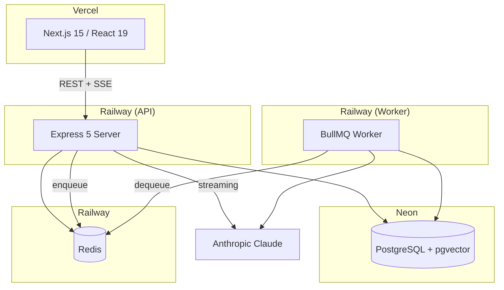
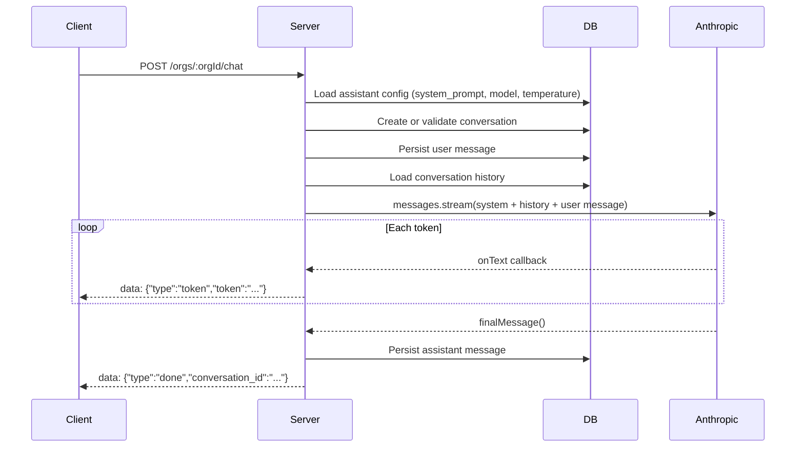
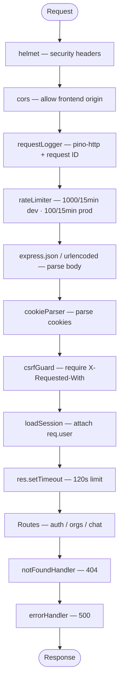

# Multi-tenant AI Assistant — Technical Overview

## Table of Contents

1. [Project Context](#1-project-context)
2. [Architecture Overview](#2-architecture-overview)
3. [Tech Stack](#3-tech-stack)
4. [Package Inventory](#4-package-inventory)
5. [Repository Structure](#5-repository-structure)
6. [Database Schema](#6-database-schema)
7. [API Reference](#7-api-reference)
8. [System Design Deep Dives](#8-system-design-deep-dives)
   - [SSE Streaming Chat](#81-sse-streaming-chat)
   - [Multi-tenant Isolation](#82-multi-tenant-isolation)
   - [Authentication & Sessions](#83-authentication--sessions)
   - [Prompt Assembly](#84-prompt-assembly)
9. [Middleware Stack](#9-middleware-stack)
10. [Frontend Architecture](#10-frontend-architecture)
11. [Deployment](#11-deployment)
12. [Architectural Decisions](#12-architectural-decisions)

---

## 1. Project Context

This is App 5 in a portfolio of eight progressive full-stack AI applications. Its primary purpose is to demonstrate **multi-tenant context scoping** — every organization gets an isolated AI assistant with its own system prompt, conversation history, and member access controls. It also introduces **conversation summarization** when token budgets are exceeded, and lays the groundwork for per-tenant knowledge base RAG.

The application is a production-grade multi-tenant SaaS platform where organizations can create, configure, and chat with their own Claude-powered AI assistant in real time.

---

## 2. Architecture Overview



**Deployment targets:**
- Frontend → Vercel (Next.js serverless)
- API server → Railway (Docker container)
- Background worker → Railway (Docker container)
- Database → Neon (serverless PostgreSQL with pgvector)
- Queue / Cache → Railway (Redis service)

---

## 3. Tech Stack

| Layer | Technology | Version | Notes |
|---|---|---|---|
| **Frontend framework** | Next.js | 15.x | App Router, server/client components |
| **UI library** | React | 19.x | Concurrent features, Suspense |
| **Client state** | TanStack React Query | 5.x | Server state caching and synchronization |
| **Language** | TypeScript | 5.x | Strict mode across all packages |
| **API server** | Express | 5.x | Async error propagation built-in |
| **Runtime** | Node.js | ≥ 22.0 | Required by server and worker |
| **Database** | PostgreSQL | 13+ | Neon (serverless), pgvector for embeddings |
| **Cache / Queue** | Redis | — | Railway, via ioredis + BullMQ |
| **LLM** | Anthropic Claude | claude-sonnet-4-20250514 | Streaming SDK with AbortController |
| **Auth** | Custom sessions | — | bcrypt + HTTP-only cookies |
| **Logging** | Pino | 10.x | JSON in prod, pino-pretty in dev |
| **Validation** | Zod | 4.x | Schemas for all request bodies |
| **Testing** | Vitest | 3.x | Unit + integration |
| **Package manager** | pnpm | 9.x | Workspaces monorepo |
| **Container** | Docker | — | Multi-stage builds for server + worker |

---

## 4. Package Inventory

### Server

**Runtime dependencies:**

| Package | Purpose |
|---|---|
| `@anthropic-ai/sdk` | Streaming Claude API calls with AbortController support |
| `@google-cloud/secret-manager` | Fetches secrets from GCP Secret Manager in production |
| `bcrypt` | Password hashing with 12 salt rounds |
| `bullmq` | Job queue for background processing (knowledge, summarization) |
| `cookie-parser` | Parses HTTP cookies into `req.cookies` |
| `cors` | Cross-origin resource sharing middleware |
| `dotenv` | Loads `.env` file into `process.env` |
| `express` | HTTP framework (v5 — async errors propagated automatically) |
| `express-rate-limit` | In-memory rate limiting; global + auth-specific |
| `helmet` | Sets security headers (XSS, clickjacking, MIME sniffing) |
| `ioredis` | Redis client with auto-reconnect |
| `node-pg-migrate` | Database migrations in JS |
| `pg` | PostgreSQL client and connection pool |
| `pino` | Structured JSON logger |
| `pino-http` | HTTP request/response logging middleware |
| `zod` | Runtime schema validation for all request bodies |

**Dev dependencies:**

| Package | Purpose |
|---|---|
| `tsx` | TypeScript execution for development (`tsx watch`) |
| `tsc-alias` | Resolves path aliases after `tsc` compilation |
| `vitest` | Test runner |
| `pino-pretty` | Human-readable log formatting in development |

### Worker

Same core dependencies as server (`@anthropic-ai/sdk`, `bullmq`, `ioredis`, `pg`, `pino`). Runs as a separate process consuming background jobs from Redis queues.

### Web Client

| Package | Purpose |
|---|---|
| `next` | React framework with App Router and SSR |
| `react` / `react-dom` | UI library |
| `@tanstack/react-query` | Server state management and caching |
| `@vercel/analytics` | Page view and event tracking |
| `@vercel/speed-insights` | Core Web Vitals monitoring |
| `sass` | SCSS compilation for module styles |
| `react-markdown` | Markdown rendering for documentation pages |
| `react-syntax-highlighter` | Code block syntax highlighting |
| `remark-gfm` | GitHub-flavored markdown (tables, strikethrough) |
| `mermaid` | Diagram rendering in documentation |

---

## 5. Repository Structure

This is a pnpm monorepo with four workspace packages: `common`, `server`, `worker`, and `web-client`.

```
multitenant-ai-assistant/
├── package.json                    # Workspace root (pnpm --parallel run dev)
├── pnpm-workspace.yaml             # Declares all packages
├── pnpm-lock.yaml
├── Dockerfile.server               # Multi-stage Docker build for the API
├── Dockerfile.worker               # Multi-stage Docker build for the worker
├── railway.toml                    # Railway deploy config
│
├── common/
│   └── src/
│       ├── index.ts                # Exports types + chunker
│       ├── types/
│       │   └── index.ts            # User, Org, Conversation, Message, etc.
│       └── chunker/
│           └── index.ts            # Recursive text chunking (500 token default)
│
├── server/
│   ├── package.json
│   ├── tsconfig.json
│   ├── .env                        # Local env (DATABASE_URL, ANTHROPIC_API_KEY, etc.)
│   ├── migrations/                 # node-pg-migrate JS files (7 total)
│   │   ├── ..._create-users-table.js
│   │   ├── ..._create-sessions-table.js
│   │   ├── ..._create-organizations-table.js
│   │   ├── ..._create-org-members-table.js
│   │   ├── ..._create-assistant-configs-table.js
│   │   ├── ..._create-conversations-table.js
│   │   └── ..._create-messages-table.js
│   └── src/
│       ├── index.ts                # Entry: load secrets → startServer()
│       ├── app.ts                  # Express app: middleware stack, routes
│       ├── config/
│       │   ├── corsConfig.ts       # CORS: frontend origin only
│       │   ├── env.ts              # isProduction() helper
│       │   ├── redis.ts            # Redis singleton (lazy init, optional)
│       │   └── secrets.ts          # GCP Secret Manager (prod only)
│       ├── constants/
│       │   └── session.ts          # SESSION_COOKIE_NAME = 'sid', SESSION_TTL_MS = 7d
│       ├── db/
│       │   └── pool/pool.ts        # pg.Pool, query() wrapper, withTransaction()
│       ├── handlers/
│       │   ├── auth/auth.ts        # register, login, logout, me
│       │   ├── chat/chat.ts        # SSE streaming chat, list conversations, get messages
│       │   └── orgs/orgs.ts        # Create, list, get org; list members
│       ├── middleware/
│       │   ├── csrfGuard/          # Requires X-Requested-With on POST/PATCH/DELETE
│       │   ├── errorHandler/       # Centralized error → 500 JSON
│       │   ├── notFoundHandler/    # 404 JSON response
│       │   ├── orgMembership/      # Validates org membership + attaches role
│       │   ├── rateLimiter/        # Global + auth-specific rate limits
│       │   ├── requestLogger/      # pino-http + request ID
│       │   └── requireAuth/        # loadSession + requireAuth guards
│       ├── prompts/
│       │   └── default-system-prompt.js
│       ├── repositories/
│       │   ├── auth/auth.ts        # User, session CRUD
│       │   ├── conversations/      # Conversation + message CRUD
│       │   └── orgs/orgs.ts        # Org + member + assistant config CRUD
│       ├── routes/
│       │   ├── auth.ts             # /auth/* routes
│       │   └── orgs.ts             # /orgs/* routes (org-scoped with middleware)
│       ├── schemas/
│       │   ├── auth.ts             # registerSchema, loginSchema (Zod)
│       │   └── org.ts              # createOrgSchema
│       ├── services/
│       │   └── chat.service.ts     # streamChat() — Anthropic streaming orchestration
│       ├── types/
│       │   └── express.d.ts        # Extends Request with user, orgMembership
│       └── utils/
│           └── logs/logger.ts      # Pino instance
│
├── worker/
│   ├── package.json
│   └── src/
│       ├── index.ts                # Entry: load secrets → health server
│       ├── workers.ts              # BullMQ queue init (POC: no processors yet)
│       ├── config/
│       │   └── secrets.ts          # GCP Secret Manager
│       ├── processors/             # [Empty] Future: knowledge-process, conversation-summary
│       └── utils/logs/logger.ts    # Pino instance
│
└── web-client/
    ├── package.json
    ├── next.config.ts
    └── src/
        ├── app/
        │   ├── layout.tsx          # Root: AuthProvider + QueryProvider + Analytics
        │   ├── page.tsx            # Landing page
        │   ├── globals.scss        # Global styles + CSS custom properties
        │   ├── (auth)/
        │   │   ├── login/page.tsx
        │   │   └── register/page.tsx
        │   ├── (protected)/
        │   │   └── orgs/
        │   │       ├── page.tsx              # List orgs + create org form
        │   │       └── [orgId]/
        │   │           ├── chat/page.tsx      # Chat UI (sidebar, messages, SSE streaming)
        │   │           └── settings/page.tsx  # Org settings + members list
        │   └── documents/
        │       └── [id]/page.tsx             # Renders markdown docs (SUMMARY, TECHNICAL_OVERVIEW)
        ├── components/
        │   ├── MarkdownViewer.tsx            # ReactMarkdown + syntax highlighting
        │   └── MermaidDiagram.tsx            # Client-side mermaid diagram rendering
        ├── contexts/
        │   └── AuthContext.tsx               # useAuth() hook, TanStack Query integration
        └── lib/
            ├── api.ts                        # apiFetch() with X-Requested-With + credentials
            └── QueryProvider.tsx             # TanStack Query client config
```

---

## 6. Database Schema

The database has seven tables. All primary keys are UUIDs generated by PostgreSQL. Foreign keys use `ON DELETE CASCADE` throughout.

### `users`
```sql
CREATE TABLE users (
  id            UUID        PRIMARY KEY DEFAULT gen_random_uuid(),
  email         TEXT        NOT NULL UNIQUE,
  password_hash TEXT        NOT NULL,
  first_name    VARCHAR(100),
  last_name     VARCHAR(100),
  created_at    TIMESTAMPTZ DEFAULT NOW(),
  updated_at    TIMESTAMPTZ DEFAULT NOW()
);
-- Trigger: automatically sets updated_at on every UPDATE
```

### `sessions`
```sql
CREATE TABLE sessions (
  id         TEXT        PRIMARY KEY,    -- SHA256 hash of the raw session token
  user_id    UUID        NOT NULL REFERENCES users ON DELETE CASCADE,
  expires_at TIMESTAMPTZ NOT NULL,       -- 7-day TTL
  created_at TIMESTAMPTZ DEFAULT NOW()
);
CREATE INDEX ON sessions (user_id);
CREATE INDEX ON sessions (expires_at);
```

The raw token is stored in the cookie; only its SHA256 hash is stored in the database. A compromised database cannot be used to impersonate sessions.

### `organizations`
```sql
CREATE TABLE organizations (
  id         UUID        PRIMARY KEY DEFAULT gen_random_uuid(),
  name       VARCHAR(100) NOT NULL,
  slug       VARCHAR(100) NOT NULL UNIQUE,  -- Auto-generated: {name-slugified}-{timestamp}
  created_at TIMESTAMPTZ DEFAULT NOW(),
  updated_at TIMESTAMPTZ DEFAULT NOW()
);
CREATE INDEX ON organizations (slug);
```

### `org_members`
```sql
CREATE TABLE org_members (
  org_id    UUID NOT NULL REFERENCES organizations ON DELETE CASCADE,
  user_id   UUID NOT NULL REFERENCES users ON DELETE CASCADE,
  role      TEXT NOT NULL,                   -- 'admin' | 'member' | 'viewer'
  joined_at TIMESTAMPTZ DEFAULT NOW(),
  PRIMARY KEY (org_id, user_id)
);
CREATE INDEX ON org_members (user_id);
```

Junction table enforcing one role per user per org. The composite primary key prevents duplicate memberships.

### `assistant_configs`
```sql
CREATE TABLE assistant_configs (
  id            UUID  PRIMARY KEY DEFAULT gen_random_uuid(),
  org_id        UUID  NOT NULL UNIQUE REFERENCES organizations ON DELETE CASCADE,
  system_prompt TEXT  NOT NULL,               -- Customizable Claude system prompt
  model         TEXT  NOT NULL,               -- e.g., 'claude-sonnet-4-20250514'
  max_tokens    INT   NOT NULL,               -- e.g., 4096
  temperature   FLOAT NOT NULL                -- e.g., 0.7
);
```

One config per org (enforced by `UNIQUE` on `org_id`). Created automatically when an organization is created, with sensible defaults.

### `conversations`
```sql
CREATE TABLE conversations (
  id         UUID        PRIMARY KEY DEFAULT gen_random_uuid(),
  org_id     UUID        NOT NULL REFERENCES organizations ON DELETE CASCADE,
  user_id    UUID        NOT NULL REFERENCES users ON DELETE CASCADE,
  title      VARCHAR(255),                    -- Auto-generated from first message
  created_at TIMESTAMPTZ DEFAULT NOW(),
  updated_at TIMESTAMPTZ DEFAULT NOW()
);
CREATE INDEX ON conversations (org_id);
CREATE INDEX ON conversations (user_id);
CREATE INDEX ON conversations (org_id, user_id);
CREATE INDEX ON conversations (created_at);
```

Conversations are doubly scoped — by organization and by user. The composite index `(org_id, user_id)` supports the most common query pattern.

### `messages`
```sql
CREATE TABLE messages (
  id              UUID    PRIMARY KEY DEFAULT gen_random_uuid(),
  conversation_id UUID    NOT NULL REFERENCES conversations ON DELETE CASCADE,
  role            TEXT    NOT NULL,            -- 'user' | 'assistant' | 'system'
  content         TEXT    NOT NULL,
  token_count     INT,                         -- Estimated via ~4 chars per token
  is_summary      BOOL    DEFAULT FALSE,       -- For conversation summarization
  created_at      TIMESTAMPTZ DEFAULT NOW()
);
CREATE INDEX ON messages (conversation_id);
CREATE INDEX ON messages (role);
```

The `is_summary` flag marks messages that are condensed summaries of prior conversation history, used when the token budget is exceeded.

---

## 7. API Reference

All routes require `Content-Type: application/json` and `X-Requested-With: XMLHttpRequest` on state-changing requests. Authentication uses an HTTP-only session cookie (`sid`).

### Authentication

Rate-limited at 100/15 min (dev) or 10/15 min (prod).

| Method | Path | Auth | Description |
|---|---|---|---|
| POST | `/auth/register` | No | Creates user + session. Body: `{ email, password, first_name, last_name }`. Returns `{ user }`. |
| POST | `/auth/login` | No | Validates credentials, creates session. Returns `{ user }`. |
| POST | `/auth/logout` | No | Deletes session from DB, clears cookie. Returns 204. |
| GET | `/auth/me` | Yes | Returns `{ user }` for current session. |

### Organizations

| Method | Path | Auth | Description |
|---|---|---|---|
| POST | `/orgs` | Yes | Creates org. Body: `{ name }`. Creator auto-added as admin. Default assistant config created. |
| GET | `/orgs` | Yes | Lists user's orgs with role. Returns `{ data: [{ id, name, slug, role, created_at }] }`. |
| GET | `/orgs/:orgId` | Membership | Get org details. |
| GET | `/orgs/:orgId/members` | Membership | List org members with roles. |

### Chat / Conversations

All routes require org membership (validated by middleware).

| Method | Path | Auth | Description |
|---|---|---|---|
| POST | `/orgs/:orgId/chat` | Membership | Start streaming chat. Body: `{ message, conversation_id? }`. Returns SSE stream. |
| GET | `/orgs/:orgId/conversations` | Membership | List user's conversations in org. Sorted by `updated_at DESC`. |
| GET | `/orgs/:orgId/conversations/:id/messages` | Membership | Get all messages in conversation. Sorted by `created_at ASC`. |

### SSE Stream Events

```
data: {"type":"token","token":"The"}
data: {"type":"token","token":" assistant"}
...
data: {"type":"done","conversation_id":"uuid-123"}
data: {"type":"error","message":"Rate limit exceeded"}
```

### Health

| Method | Path | Auth | Description |
|---|---|---|---|
| GET | `/health` | No | Returns `{ status: "ok" }` immediately. |
| GET | `/health/ready` | No | Queries DB; returns `{ status: "ok", db: "connected" }` or 503. |

---

## 8. System Design Deep Dives

### 8.1 SSE Streaming Chat

Server-Sent Events are used instead of WebSockets because responses are strictly unidirectional (server → client), request-scoped, and don't require persistent bidirectional state. SSE works through proxies, supports auto-reconnect natively, and requires no handshake.

**End-to-end flow:**



**Implementation details:**

Response headers are set immediately:
```
Content-Type: text/event-stream
Cache-Control: no-cache
Connection: keep-alive
X-Accel-Buffering: no
```

`res.flushHeaders()` sends headers before any body content, ensuring the client can start processing events immediately.

**Request cancellation:**

```typescript
const abortController = new AbortController();
req.on('close', () => abortController.abort());

// Signal passed to SDK — cancels in-flight API call
const stream = anthropic.messages.stream({ ... }, { signal: abortController.signal });
```

If the user navigates away mid-stream, the Anthropic API call is cancelled immediately, saving tokens. The partial assistant response is persisted with whatever content was streamed.

**Auto-titling:** The first user message in a conversation is truncated to 80 characters and used as the conversation title.

---

### 8.2 Multi-tenant Isolation

Tenant isolation is enforced at three independent layers — any one of them is sufficient, but all three operate simultaneously.

**Layer 1 — Middleware:**

The `orgMembership` middleware runs on every org-scoped route. It queries the `org_members` table to verify the authenticated user is a member of the target org. If not, the request is rejected with 403 before reaching any handler.

```typescript
// Simplified
const membership = await getMembership(orgId, req.user.id);
if (!membership) return res.status(403).json({ error: 'Not a member' });
req.orgMembership = { orgId, role: membership.role };
next();
```

**Layer 2 — Repository:**

Every database query that touches tenant data includes `org_id` as a parameter. There are no cross-org query methods.

```sql
-- Listing conversations is always scoped
SELECT * FROM conversations WHERE org_id = $1 AND user_id = $2 ORDER BY updated_at DESC

-- Loading messages validates conversation ownership
SELECT c.id FROM conversations WHERE id = $1 AND org_id = $2
-- Only then: SELECT * FROM messages WHERE conversation_id = $1
```

**Layer 3 — Database:**

Foreign key constraints ensure referential integrity. An `org_members` row must reference a valid org. Conversations must reference a valid org. Messages must reference a valid conversation. Cascading deletes ensure that deleting an organization removes all its conversations, messages, members, and config.

**Data access rules:**
- Users can only list orgs they are members of (query joins `org_members`)
- Users can only access conversations in orgs they belong to (middleware + WHERE clause)
- Conversations are further scoped by `user_id` — members cannot see each other's conversations
- There is no admin "view all" endpoint — every query is scoped

---

### 8.3 Authentication & Sessions

**Session token design:**

1. Server generates `crypto.randomBytes(32).toString('hex')` — a 64-character random hex string
2. The **raw token** is sent to the browser in an HTTP-only cookie (`sid`)
3. A **SHA256 hash** of the token is stored in the `sessions` table

A database breach cannot hijack sessions — the attacker has hashes, not original tokens.

**Login flow (transactional):**

```typescript
return withTransaction(async (client) => {
  // Single-session-per-account: invalidate all existing sessions
  await query('DELETE FROM sessions WHERE user_id = $1', [userId], client);
  return createSession(userId, client);
});
```

**Cookie settings:**

```typescript
{
  httpOnly: true,                                // Inaccessible to JavaScript
  secure: isProduction(),                        // HTTPS-only in production
  sameSite: isProduction() ? 'none' : 'lax',    // 'none' for cross-domain (Vercel ↔ Railway)
  maxAge: 7 * 24 * 60 * 60 * 1000,              // 7 days
  path: '/',
}
```

**Middleware chain:**

- `loadSession` — Runs on every request. Looks up session by hashed cookie, attaches `req.user` if valid. Fails open (no user attached if lookup fails).
- `requireAuth` — Returns 401 if `req.user` is not set.
- `orgMembership` — Validates org membership, attaches `req.orgMembership` with `{ orgId, role }`.

---

### 8.4 Prompt Assembly

Each chat request assembles a prompt from multiple sources:

```
┌─────────────────────────────────────┐
│ 1. Organization system prompt       │  ← From assistant_configs table
│    (configurable per org)           │
├─────────────────────────────────────┤
│ 2. Conversation summary             │  ← If token budget exceeded (is_summary=true)
├─────────────────────────────────────┤
│ 3. Recent message history           │  ← All user + assistant messages
├─────────────────────────────────────┤
│ 4. Knowledge chunks (future)        │  ← Semantic search results from pgvector
├─────────────────────────────────────┤
│ 5. Current user message             │  ← The new message being sent
└─────────────────────────────────────┘
```

The system prompt is sent as the Anthropic SDK's `system` parameter. Message history is sent as alternating `user`/`assistant` message pairs. The org's `model`, `max_tokens`, and `temperature` settings from `assistant_configs` are passed to the Anthropic API call.

**Conversation summarization (future):**

When total message tokens approach the model's context limit, older messages will be summarized into a single system message with `is_summary = true`. The summary replaces the original messages in the prompt, preserving context while staying within the token budget.

**Text chunking (common library):**

The `common/src/chunker` module provides recursive text splitting for the future knowledge base:

```typescript
chunkText(text, {
  maxTokens: 500,        // Default chunk size
  overlapTokens: 50,     // Overlap between chunks
  separators: ['\n\n', '\n', '. ', ' ']
})
```

Returns `{ content, index, tokenCount }[]`. Will be used when knowledge documents are uploaded and embedded for RAG retrieval.

---

## 9. Middleware Stack

Middleware is applied in this order for every request:



**CSRF protection:**

Rather than stateful CSRF tokens, the app uses the `X-Requested-With` header check. Browsers cannot set custom headers in cross-site requests without a CORS preflight. Since CORS is locked to the frontend origin, any request with `X-Requested-With` present must have come from a trusted origin. The `api.ts` client adds this header automatically.

---

## 10. Frontend Architecture

### Route Structure

```
/ (landing — auth buttons or My Orgs link)
├── (auth)/
│   ├── login/
│   └── register/
├── (protected)/
│   └── orgs/
│       ├── page.tsx (list orgs + create form)
│       └── [orgId]/
│           ├── chat/page.tsx (main chat interface)
│           └── settings/page.tsx (org info + members)
└── documents/
    └── [id]/page.tsx (markdown documentation viewer)
```

### State Management

- **TanStack React Query** — manages `auth/me` session (with `staleTime: Infinity`), orgs list, conversations, and messages
- **React `useState`** — local UI state (form inputs, streaming status, selected conversation)

No global client-side store. All data is fetched via React Query and mutated via cache invalidation after API calls.

### Auth Context

```typescript
// AuthContext provides:
{
  user: User | null,
  loading: boolean,
  login: (email, password) => Promise<void>,
  register: (email, password, firstName, lastName) => Promise<void>,
  logout: () => Promise<void>,
}
```

### SSE Client Pattern

The chat page opens a POST request and reads the response body as a stream:

```typescript
const res = await fetch(`${API_BASE}/orgs/${orgId}/chat`, {
  method: 'POST',
  credentials: 'include',
  headers: { 'X-Requested-With': 'XMLHttpRequest', 'Content-Type': 'application/json' },
  body: JSON.stringify({ message, conversation_id }),
});

const reader = res.body.getReader();
const decoder = new TextDecoder();
let buffer = '';

while (true) {
  const { done, value } = await reader.read();
  if (done) break;

  buffer += decoder.decode(value, { stream: true });
  const lines = buffer.split('\n');
  buffer = lines.pop();

  for (const line of lines) {
    if (!line.startsWith('data: ')) continue;
    const event = JSON.parse(line.slice(6));

    if (event.type === 'token') {
      // Append token to the assistant's in-progress message
    } else if (event.type === 'done') {
      // Refresh conversation list via queryClient.invalidateQueries
    }
  }
}
```

### Documentation Viewer

The `/documents/[id]` route maps document IDs to markdown files in the `docs/` directory:

```typescript
const DOCS: Record<string, { file: string; title: string }> = {
  summary: { file: 'SUMMARY.md', title: 'Summary' },
  'technical-overview': { file: 'TECHNICAL_OVERVIEW.md', title: 'Technical Overview' },
};
```

Files are read at build time via `fs.readFile` and rendered through the `MarkdownViewer` component, which supports syntax-highlighted code blocks, GitHub-flavored markdown tables, and mermaid diagrams.

---

## 11. Deployment

### Server (Railway)

Two-stage Docker build:

**Stage 1 — Build:**
- Node 22 slim base
- Install all dependencies (including dev deps for TypeScript)
- Run `tsc` → `tsc-alias` to compile and resolve path aliases

**Stage 2 — Production:**
- Fresh Node 22 slim base
- Install production dependencies only
- Copy `dist/` and `migrations/` from build stage
- Expose port 3001

```toml
# railway.toml
[build]
dockerfilePath = "Dockerfile.server"

[deploy]
healthcheckPath = "/health"
healthcheckTimeout = 30
restartPolicyType = "ON_FAILURE"
restartPolicyMaxRetries = 3
```

### Worker (Railway)

Same Docker pattern as server but using `Dockerfile.worker`. Runs a BullMQ consumer process with an HTTP health server on port 3001 for Railway's health checks.

### Frontend (Vercel)

Zero-config Next.js deployment. Only environment variable: `NEXT_PUBLIC_API_URL` pointing to the Railway API.

### Environment Variables

**Server + Worker (Railway):**

| Variable | Required | Description |
|---|---|---|
| `DATABASE_URL` | Yes | PostgreSQL connection string (Neon pooler URL) |
| `ANTHROPIC_API_KEY` | Yes | Claude API key |
| `CORS_ORIGIN` | Yes (prod) | Frontend URL |
| `REDIS_URL` | No | Redis connection; caching/queue disabled if absent |
| `NODE_ENV` | No | Set to `production` on Railway |
| `PORT` | No | HTTP port (default: 3001) |
| `GCP_PROJECT_ID` | No | GCP project for Secret Manager |
| `GCP_SA_JSON` | No | GCP service account credentials JSON |

**Web Client (Vercel):**

| Variable | Required | Description |
|---|---|---|
| `NEXT_PUBLIC_API_URL` | Yes (prod) | API base URL (default: `http://localhost:3001`) |

### Database Migrations

Migrations are run manually via `pnpm migrate:up` before deploying schema changes. They are plain JavaScript (not TypeScript) so they execute directly without a compilation step. Named with Unix timestamps to guarantee ordering.

---

## 12. Architectural Decisions

### Express 5 over Express 4

Express 5 automatically catches errors thrown in async route handlers and passes them to the error-handling middleware. This eliminates try/catch in every handler. All handlers throw normally and rely on the centralized `errorHandler`.

### Custom Sessions vs. OAuth / Supabase Auth

Full control over the auth flow, no third-party dependency, simple single-session-per-account model. Session hashing means a database breach cannot be weaponized for session hijacking.

### Three-Layer Tenant Isolation

Middleware, repository, and database constraints each independently enforce isolation. Defense in depth — a bug in one layer doesn't expose cross-tenant data.

### Org-Scoped Assistant Configs

Each organization's AI behavior is configurable (system prompt, model, temperature, max tokens) via the `assistant_configs` table. This is the core multi-tenant differentiator — each org effectively has a different AI assistant.

### BullMQ for Background Jobs

Redis-backed job queue for eventual knowledge document processing and conversation summarization. The worker runs as a separate Railway service, scaling independently from the API server.

### pgvector for Embeddings

PostgreSQL's `pgvector` extension is installed and ready for knowledge base RAG. Embeddings will be stored alongside chunk content in a future `knowledge_chunks` table, enabling semantic similarity search without a separate vector database.

### Fail-Open Redis

Redis is optional infrastructure. If `REDIS_URL` is not set or the connection fails, the application continues without caching or job queuing. This prevents Redis outages from cascading into full application downtime.

### SameSite=None Cookies

The frontend (Vercel) and API (Railway) live on different domains. `SameSite=None` with `Secure=true` is required for the browser to send session cookies on cross-origin requests. HTTPS is mandatory in production.

### Transaction-Based Auth

Registration and login use database transactions. Registration: `createUser` + `createSession` atomically — no orphaned users. Login: `deleteOldSessions` + `createSession` atomically — no window where all sessions are cleared but the new one doesn't exist.

### Monorepo with Shared Common Package

The `common` package exports shared types and utilities (chunker) used by both server and worker. This ensures type consistency across services and avoids duplication of domain types.

### node-pg-migrate with JS Files

Migrations are plain JavaScript so they run directly in production without TypeScript compilation. The migration runner is invoked manually before deploying, not at container start (which would race with multiple instances).
